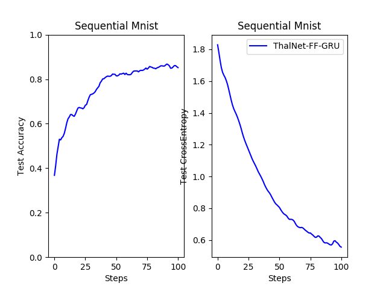
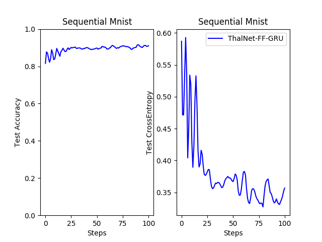
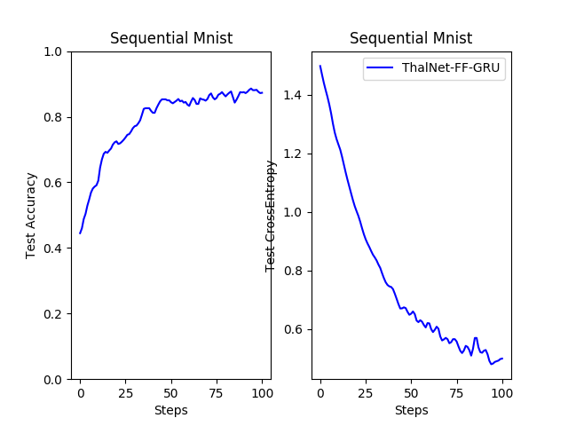

# thalnet
Open-source implementation of ThalNet (https://arxiv.org/pdf/1706.05744.pdf)

---

## Oct 13th Mnist success!
All models are under 60,000 total parameters.
### MLP

### GRU 

### ThalNet-GRU 

### ThalNet-FF-GRU

## Learning Curve Comparison

## MNIST reding weights visualization

### Initial reading weights

### After training

## Demonstrate ensemble property (MNIST)

This section includes tests on deleting side modules after training

### Cut all side modules

### Cut module 2

### Cut module 3

